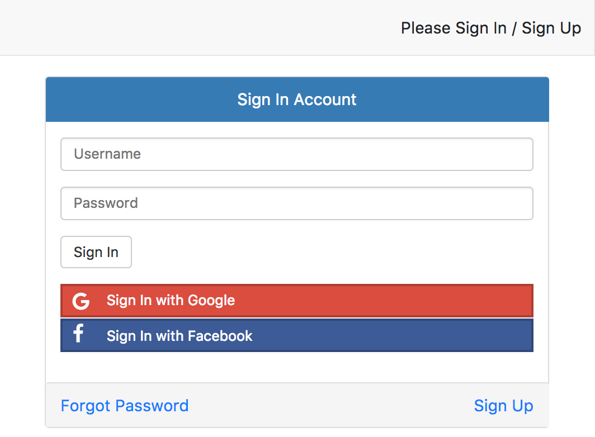
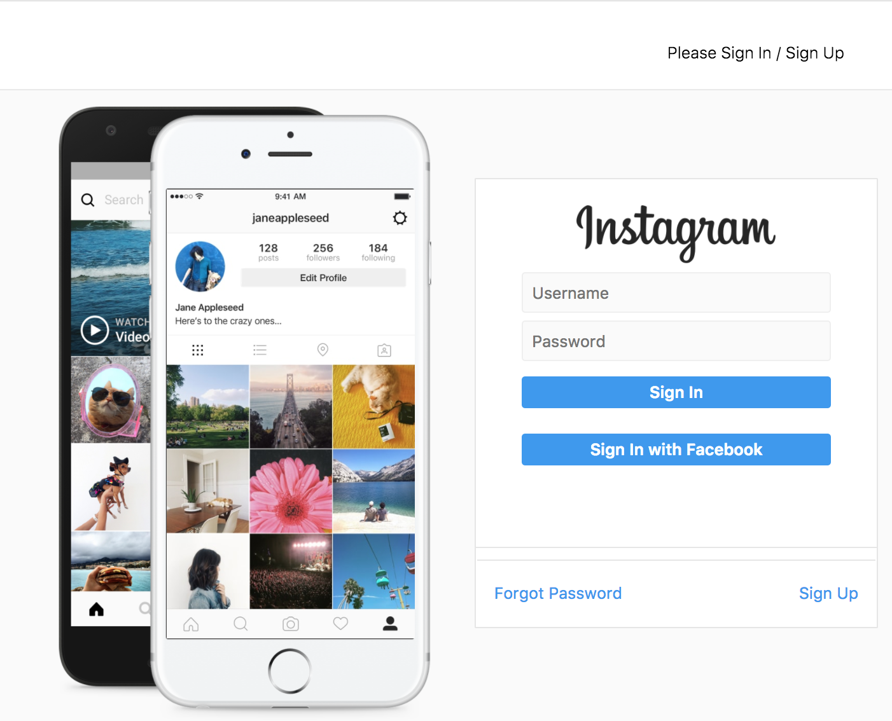

# A Theme React

AWS Amplify UI is theme based. Developers are able to customize UI with theme.

Here we build alternative themes for AWS Amplify.

* [Install](#install)
* [Apply](#apply)
* [Themes](#themes)
  - [Bootstrap](#bootstrap)
  - [Instagram](#instagram)

## Install

```
npm install --save a-theme-react
```

## Apply

AWS Amplify UI is theme

```
import { Bootstrap } from 'a-theme-react';

<Authenticator theme={Bootstrap} />
```

## Themes

### Bootstrap

A theme base on default Bootstrap theme CSS.



```
import { Bootstrap } from 'a-theme-react';

<Authenticator theme={Bootstrap} />
```

**FontAwsome Icons**

`Bootstrap` theme uses icons from [Font Awesome](http://fontawesome.io/). [react-fontawesome](https://github.com/danawoodman/react-fontawesome) does not include CSS. So you have to include the CSS by yourself. One way is from [CDN](https://www.bootstrapcdn.com/fontawesome/).

For example add this line to HTML file:
```
<link rel="stylesheet" type="text/css" href="https://maxcdn.bootstrapcdn.com/font-awesome/4.7.0/css/font-awesome.min.css" />
```

The icons won't display without the CSS file. Everything else is not affected.

### Instagram

A theme imitates [Instagram](https://www.instagram.com)



```
import { Instagram } from 'a-theme-react';

<Authenticator theme={Instagram} />
```

**CSS Pseudo-Elements**

One of the limitation in React inline styling is no pseudo-elements.

Among CSS pseudo-elements, `::before` and `::after` are the two most frequent used. AWS Amplify UI is made to support these two.

Here we take benefit of `before` and `after` to make this theme possible.

Example:

```
const beforeImg = (
    
)

export const FormSection = {
    margin: '0 0 10px',
    color: '#262626',
    backgroundColor: '#fff',
    border: '1px solid #e6e6e6',
    borderRadius: '1px',
    textAlign: 'center',
    width: '350px',
    display: 'inline-block',
    verticalAlign: 'middle',
    before: {
        content: beforeImg,
        display: 'inline-block',
        width: '400px',
        height: '560px',
        verticalAlign: 'middle',
        backgroundImage: 'url(' + home_phone + ')',
        backgroundSize: '400px 560px'
    }
}
```
